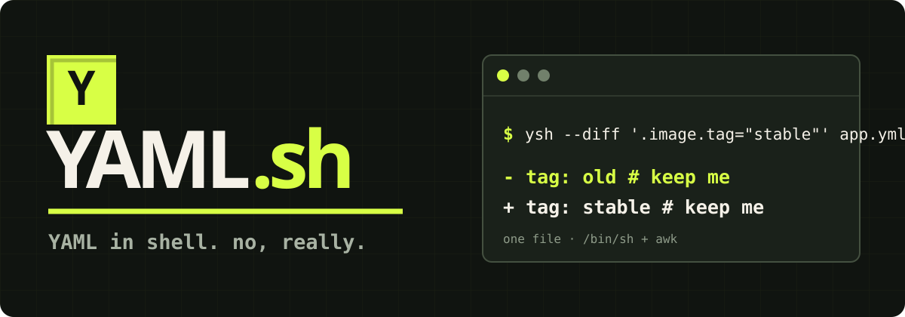

<p align="center">
  
</p>

<p align="center">
  <strong>A useful YAML tool for the moment before you can install tools.</strong>
</p>

<p align="center">
  <a href="https://github.com/azohra/yaml.sh/releases/latest"></a>
  <a href="https://github.com/azohra/yaml.sh/actions/workflows/ci.yml"></a>
  
</p>

<p align="center">
  <a href="https://yaml.azohra.com">Website</a> ·
  <a href="https://yaml.azohra.com/docs/">Docs</a> ·
  <a href="https://yaml.azohra.com/docs/recipes/">Recipes</a> ·
  <a href="https://yaml.azohra.com/docs/operators/">Operator manifest</a>
</p>

---

YAML.sh brings a focused, yq-shaped query language to bootstrap scripts, tiny containers, old machines, and mildly cursed recovery shells. The released `ysh` is one readable text file: a POSIX `/bin/sh` launcher with its AWK parser and evaluator embedded.

No package manager. No language runtime. No YAML library. No mystery binary.

```console
$ ysh '.services[] | select(.enabled) | .name' config.yml
api
web

$ ysh -i '.services[] | select(.enabled) | .tier = "active"' config.yml

$ ysh --preserve-only --diff '.image.tag = "stable"' deploy/*.yml
--- a/deploy/api.yml
+++ b/deploy/api.yml
@@ -1,2 +1,2 @@
-image: app:old # promoted by CI
+image: app:stable # promoted by CI
```

## Install one file

With Homebrew:

```sh
brew install azohra/tools/ysh
```

Or install the release directly. The hosted installer downloads the artifact, verifies its pinned SHA-256 digest, then writes it to `/usr/local/bin`:

```sh
curl -fsSL https://yaml.azohra.com/install | sh
```

Install without `sudo`:

```sh
curl -fsSL https://yaml.azohra.com/install | YSH_INSTALL_DIR="$HOME/.local/bin" sh
```

Requirements: `/bin/sh` and AWK. That is the whole runtime dependency graph.

## Why this exists

Sometimes yq is exactly right. Sometimes you are writing the script that would install yq.

YAML.sh is for that second moment. It keeps the useful paths, streams, filters, construction, updates, environment composition, multi-file transactions, embedded codecs, and guarded local loads. The portable boundary now excludes XML, dates, system execution, and yq's format-heavy CLI—not useful work merely because it looked ambitious.

The constraint is the fun part.

## Do real configuration work

Read and filter:

```sh
ysh '.server.ports[1]' config.yml
ysh '.services[] | select(.enabled) | .name' config.yml
ysh '.services | filter(.port >= 8000) | map(.name)' config.yml
ysh '.owner | trim' config.yml
```

Build and update:

```sh
ysh -n -o=yaml '{name: "api", enabled: true, ports: [8080, 8443]}'
ysh -o=yaml '.replicas += 1 | del(.metadata.internal)' deploy.yml
ysh -i '.image.tag = "stable"' deploy.yml
ysh -i 'setpath(["jobs", "deploy", "runs-on"]; "ubuntu-latest")' workflow.yml
ysh -i '.metadata.release = "2026-08"' services/*.yml
ysh -o=yaml 'sort_keys(..)' config.yml
```

Compose files and environment:

```sh
IMAGE_TAG=stable ysh -i '.image.tag = strenv(IMAGE_TAG)' deploy.yml
ysh eval-all 'select(fileIndex == 0) * select(fileIndex == 1)' defaults.yml production.yml
ysh eval-all '. as $doc ireduce ({}; . * $doc)' defaults.yml region.yml secrets.yml
ysh eval-all -i 'select(fileIndex == 0).tag as $tag | select(fileIndex > 0).image.tag = $tag' release.yml services/*.yml
```

Decode embedded configuration or load a local default:

```sh
ysh '.payload | from_json | .services[] | select(.enabled)' config.yml
ysh -n 'load("defaults.yml") * load("production.yml")'
ysh '.object | @yaml | @base64' config.yml
```

JSON, YAML, properties, CSV, TSV, Base64, URI, and shell codecs run inside the same file. `eval(EXPR)` handles data-driven YAML.sh expressions. Disable local reads with `--security-disable-file-ops`; use `--shuffle-seed N` for reproducible shuffle.

Guard an update with a useful failure:

```sh
ysh -i 'with(.kind; select(. == "Deployment") or error("expected Deployment")) | .spec.replicas = 3' deploy.yml
```

Preview and commit a repository with the same query:

```sh
ysh --check '.image.tag = "stable"' services/*.yml
ysh --diff '.image.tag = "stable"' services/*.yml
ysh --preserve-only --diff '.image.tag = "stable"' services/*.yml
ysh -i '.image.tag = "stable"' services/*.yml
```

`--check` and `--diff` write nothing and exit `0` when clean, `1` for drift, and `2` on error. Diff mode prints the exact candidates that `-i` would commit. Add `--preserve-only` to reject any edit that would regenerate YAML presentation.

Inspect the parser:

```sh
ysh --type '.release.created' config.yml
ysh --line '.services[0].port' config.yml
ysh '[.services[0].port | line, .services[0].port | column]' config.yml
ysh --events config.yml
ysh --ast config.yml
ysh --explain -i '.image.tag = "stable"' deploy.yml
ysh --explain=json -i '.image.tag = "stable"' deploy/*.yml 2>changes.jsonl
```

`--explain` writes mutation paths, the presentation decision, and the prepared source-edit count to stderr without echoing values. Its JSON form emits one audit record per input, including whether the final candidate actually differs.

The [recipe book](https://yaml.azohra.com/docs/recipes/) starts with tasks. The [query guide](https://yaml.azohra.com/docs/queries/) covers the language.

## One file, real structure

YAML.sh parses YAML into a node graph:

```text
YAML stream → node graph → aliases + merges → expression stream → values / YAML
```

Mappings remain mappings. Empty collections survive. Tags and source lines stay attached. Anchors and aliases retain shared identity. Updates operate on selected nodes rather than reconstructed strings.

After evaluation, YAML.sh compiles a non-overlapping edit plan against the original source. Scalar replacements, flow collections, block scalars, block inserts/appends, comment edits, record deletions, and mapping or sequence reorders keep untouched bytes intact. Attached comments move with their records; edits through aliases or merges update the owned anchor source. Changed flow spans use stable flow formatting. Unsupported structural edits fall back to deterministic semantic YAML unless `--preserve-only` is set.

Multi-file `-i` evaluates preserved source snapshots, then verifies the live inputs still match before replacing anything. Each changed file is checked again immediately before its atomic sibling rename. Drift aborts the transaction; a commit failure or interrupt restores the evaluated snapshots. Writable `eval-all` can read one file and update another under the same guarded transaction.

## Know what you can rely on

Every public claim has an owner:

| Guarantee | Evidence |
| --- | --- |
| Parsed YAML has the documented graph semantics | Pinned YAML Test Suite outcomes plus a fail-closed boundary matrix |
| Listed yq-shaped forms agree with yq | A form-by-form manifest, differential oracle, and configuration workflows |
| A preview is the candidate that will be committed | Shared check/diff/write plans, drift races, injected failures, and rollback tests |
| Strict edits keep bytes outside owned spans | Exact source-preservation properties across scalar, flow, block, record, alias, and reorder edits |
| The one-file runtime stays portable and bounded | Cross-AWK/shell CI plus time, node, depth, document, and memory limits |

The [operator manifest](https://yaml.azohra.com/docs/operators/) says supported, focused, or excluded for every YAML-oriented yq area. [YAML support](https://yaml.azohra.com/docs/supported_yml/) does the same for syntax. Nearby unsupported input gets an explicit error instead of a confident misparse.

## A controllable security model

YAML.sh does not run YAML as shell code, execute commands, access the network, or construct application objects from tags. Explicit environment and file operators have separate disable switches. Input, loaded bytes, embedded parses, dynamic expressions, graph nodes, and collection depth share configurable ceilings.

```sh
ysh \
  --max-input-bytes 1048576 \
  --max-nodes 20000 \
  --max-depth 80 \
  --security-disable-env-ops \
  --security-disable-file-ops \
  '.metadata.name' untrusted.yml
```

See [security and limits](https://yaml.azohra.com/docs/security/) for the trust boundary.

## CLI at a glance

```text
ysh [OPTIONS] QUERY [FILE...]
ysh eval-all QUERY FILE...
```

| Option | Purpose |
| --- | --- |
| `-o value|raw|json|yaml` | Select output form |
| `-r`, `--json`, `-y` | Raw scalar, JSON, or YAML shortcuts |
| `-i` | Transactionally update one or more real files |
| `--check` | Report whether the same update would change files: clean `0`, drift `1`, error `2` |
| `--diff` | Print the prepared transaction as unified diffs: clean `0`, drift `1`, error `2` |
| `--preserve-only` | Refuse an edit that would regenerate source presentation |
| `-n` | Build output without reading input |
| `-e` | Fail on empty, null, or false output |
| `-I N`, `--unwrap-scalar=false` | Control YAML indentation or retain scalar presentation |
| `-d N`, `--all-documents` | Select one or every YAML document |
| `--type`, `--tag`, `--line` | Inspect selected node metadata |
| `--ast`, `--events` | Inspect parser structure |
| `--explain`, `--explain=json` | Report value-free mutations and presentation behavior |
| `--security-disable-env-ops`, `--security-disable-file-ops` | Disable explicit environment or local-file reads |
| `--shuffle-seed N` | Make portable shuffle reproducible |
| `--max-input-bytes`, `--max-nodes`, `--max-depth` | Bound hostile input |

Run `ysh --help` for the complete interface.

## Hack on it

```sh
make all
```

That builds the standalone file, runs ShellCheck, and executes the behavioral suite. The portability matrix covers macOS AWK, mawk, original AWK, POSIX-mode gawk, BusyBox AWK, and several POSIX shells. Release evidence adds the operator manifest, parser boundaries, conformance, yq differential, preservation properties, fault injection, and scale.

The implementation is intentionally inspectable. Start with the [internals guide](https://yaml.azohra.com/docs/internals/) or [development guide](https://yaml.azohra.com/docs/development/).

## License

[MIT](LICENSE)
