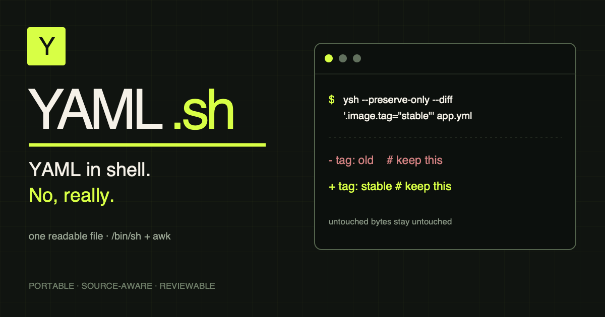

<p align="center">
  
</p>

<p align="center">
  <strong>One file. Two old friends. A suspiciously capable YAML parser.</strong>
</p>

<p align="center">
  <a href="https://github.com/azohra/yaml.sh/releases/latest"></a>
  <a href="https://github.com/azohra/yaml.sh/actions/workflows/ci.yml"></a>
  
</p>

<p align="center">
  <a href="https://yaml.azohra.com">Website</a> ·
  <a href="https://yaml.azohra.com/docs/">Documentation</a> ·
  <a href="https://yaml.azohra.com/install">Install</a> ·
  <a href="_static/_www/docs/supported_yml.md">YAML support</a>
</p>

---

YAML.sh is the tool for the moment immediately before you can install tools.

It brings yq-shaped queries to bootstrap scripts, tiny containers, old machines, CI runners, and mildly cursed recovery shells. The released `ysh` is one readable text file containing a POSIX `/bin/sh` launcher and an embedded AWK engine—no package manager, language runtime, YAML library, or mystery binary required.

```console
$ ysh '.services[0].port' config.yml
8080

$ ysh -o=json '.services[0]' config.yml
{"name":"api","enabled":true,"port":8080}

$ ysh '.services[] | select(.enabled) | .name' config.yml
api
web

$ ysh -i '.services[] | select(.enabled) | .tier = "active"' config.yml
```

## The tiny idea

Sometimes `yq` is exactly the right answer. Sometimes you are writing the script that would install `yq`.

YAML.sh lives in that second moment. Version 1 stopped pretending YAML was flattened text and built a real node graph instead:

```text
YAML stream → node graph → aliases + merges → expression stream → values / YAML
```

Mappings stay mappings. Empty sequences survive. Aliases retain identity. Keys containing dots no longer turn into existential crises.

## Install one file

```sh
curl -fsSL https://raw.githubusercontent.com/azohra/yaml.sh/v2.0.0/ysh -o ysh
chmod +x ysh
sudo mv ysh /usr/local/bin/ysh
```

Or let the tiny installer do those three lines:

```sh
curl -fsSL https://yaml.azohra.com/install | sh
```

No `sudo` mood today?

```sh
curl -fsSL https://yaml.azohra.com/install | YSH_INSTALL_DIR="$HOME/.local/bin" sh
```

## Query something

Given:

```yaml
server:
  host: localhost
  ports: [8080, 8443]
services:
  - name: api
    enabled: true
```

Ask small, direct questions:

```sh
ysh '.server.host' config.yml
# localhost

ysh '.server.ports[1]' config.yml
# 8443

ysh '.services[0]' config.yml
# {"name":"api","enabled":true}
```

Then let the expression engine stream and filter real nodes:

```sh
ysh '.services[] | select(.enabled) | .name' config.yml
# api

ysh '.services | length' config.yml
# 1

ysh '.missing // "fallback"' config.yml
# fallback
```

## Make it change things

Version 2 gives those node references a small programming language. Assign values, build missing paths, update relative to the current value, or delete a node:

```sh
ysh -o=yaml '.release.channel = "stable"' config.yml
ysh -o=yaml '.replicas += 1' config.yml
ysh -o=yaml 'del(.metadata.internal)' config.yml
```

Ready to commit to the bit?

```sh
ysh -i '.services[] | select(.enabled) | .tier = "active"' config.yml
```

`-i` requires a real file, writes only after every document parses and transforms successfully, and preserves its permissions. Version 2 patches scalar-only changes into the original source, retaining comments, blank lines, key layout, and plain/single/double quote style. Structural changes automatically fall back to deterministic semantic YAML. Multi-document files are transformed document by document.

Construct a fresh document without reading input:

```sh
ysh -n -o=yaml '{name: "api", enabled: true, ports: [8080, 8443]}'
```

And yes, AWK is now doing arithmetic too:

```sh
ysh -n --json '2 + 3 * 4'
# 14
```

Version 2 also crosses the line from query syntax into collection programming:

```sh
ysh '.services | map(.name) | unique' config.yml
ysh '.metadata | with_entries(.value |= upcase)' config.yml
ysh '.key as $key | .data[$key]' config.yml
ysh 'reduce .services[].port as $port (0; . + $port)' config.yml
```

There are comma streams, variables, dynamic indexes, `map`/`map_values`, entries, sorting, uniqueness, flattening, string operations, reducers, and recursive mapping merge. It is still deliberately smaller than yq; the exact boundary is part of the documentation rather than a surprise in production.

Pipe YAML in naturally:

```sh
printf '%s\n' 'answer: 42' | ysh '.answer'
# 42
```

When punctuation belongs to the key, make the boundary explicit:

```sh
ysh '.["key.with.dots"]' config.yml
ysh '.metadata["build[number]"]' config.yml
```

## Version 1 changed the deal

| v0.x | v1 |
| --- | --- |
| Flattened `path="value"` records | Mapping, sequence, scalar, and alias nodes |
| Bash | Portable `/bin/sh` |
| Chainable query flags | One yq-style expression stream |
| Collection identity lost | Empty `{}` and `[]` preserved |
| Partial merge handling | Alias lists, flow mappings, and block merge sequences |
| Parser internals hidden | `--ast` and `--events` on tap |

Version 1 established the graph and writable evaluator. Version 2 adds collection programming, variables, reducers, deeper YAML syntax, multi-document mutation, and hybrid presentation-preserving edits without changing the one-file runtime. The original v1 CLI break remains intentional. See the [migration guide](_static/_www/docs/migration.md) if an old script still speaks `-f ... -Q ...`.

## Open the hood

```sh
ysh --type '.enabled' config.yml
ysh --tag '.custom' config.yml
ysh --line '.server.host' config.yml
ysh --ast config.yml
ysh --events config.yml
```

Selected collections emit compact JSON by default. `--json` or `-o=json` also turns recognized nulls, booleans, integers, and finite floats into native JSON scalar values.

Multi-document streams are zero-indexed:

```sh
ysh --document 1 '.project.name' stream.yml
```

<details>
<summary><strong>Command reference</strong></summary>

| Flag | Purpose |
| --- | --- |
| `QUERY [FILE]` | Query a file or standard input. |
| `-o, --output FORMAT` | Select `value`, `raw`, `json`, or `yaml`. |
| `-r, --raw-output` | Print scalar text without JSON quoting. |
| `--json` | Emit JSON. |
| `-y, --yaml-output` | Emit YAML. |
| `--type` | Print the selected node type. |
| `--tag` | Print its expanded tag. |
| `--line` | Print its source line. |
| `--ast` | Print the node graph. |
| `--events` | Print parser-style events. |
| `-d, --document N` | Select a zero-based document. |
| `-n, --null-input` | Build output without reading input. |
| `-i, --inplace` | Transform and replace one YAML file. |
| `-V, --version` | Print the installed version. |
| `-h, --help` | Print help. |

</details>

## The honest bit

YAML is enormous. YAML.sh is not a complete YAML 1.2 processor, and it does not cosplay as one.

The tested subset includes common block and flow collections, quoted and block scalars, anchors, aliases, merge keys, tags, directives, explicit scalar keys, source lines, and multiple documents. The boundaries—including multiline flow collections, recursive aliases, collection-valued keys, and full schema resolution—are written down in the [support contract](_static/_www/docs/supported_yml.md).

That contract is the promise: supported syntax gets a test; neighboring unsupported syntax gets an explicit error instead of a confident misparse.

## Hack on it

```sh
make all
```

That rebuilds the standalone `ysh`, runs ShellCheck, and executes 64 behavioral tests. Hosted CI repeats the suite with macOS AWK, Ubuntu AWK, BusyBox AWK, and `/bin/sh`.

The constraint is the fun part. Come make AWK do something unreasonable.

## License

[MIT](LICENSE)
